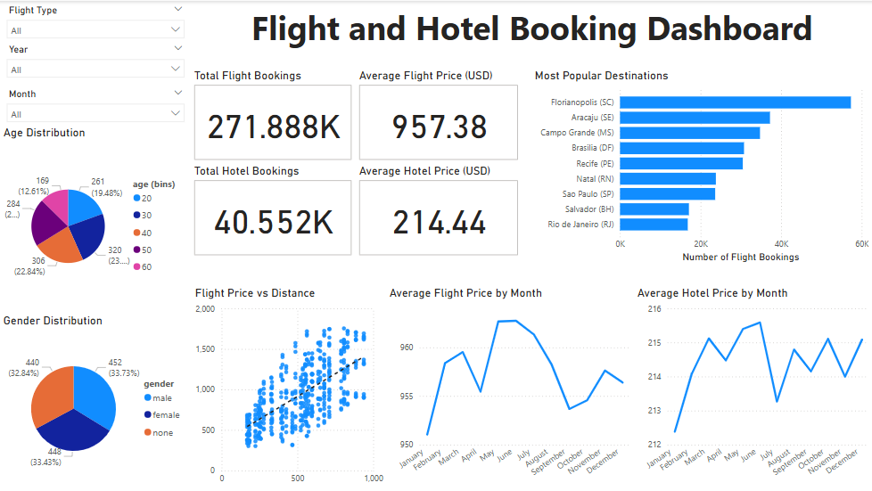
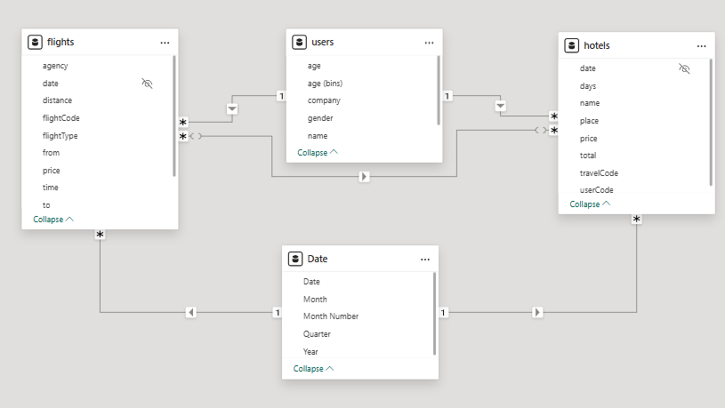
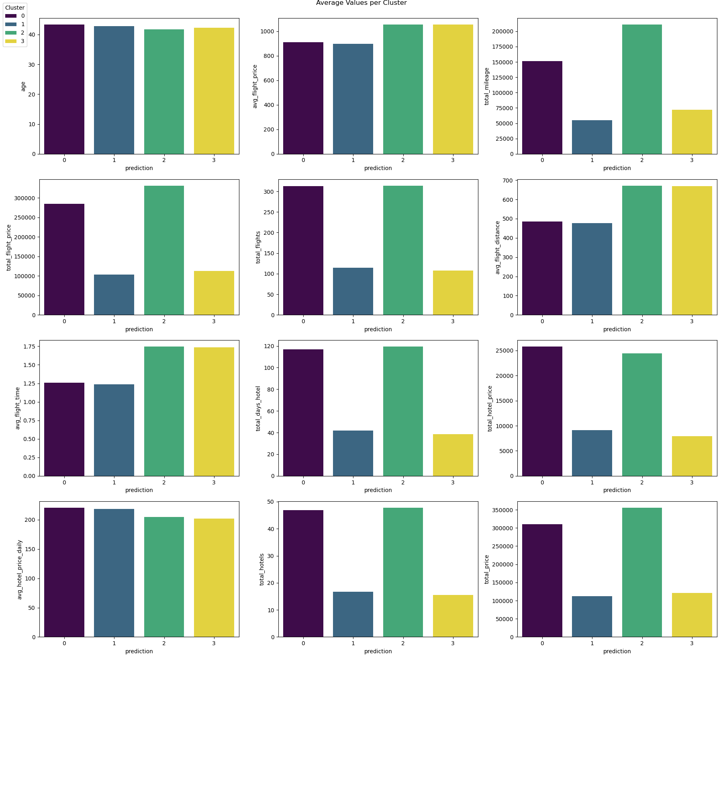

# Customer Behavior Analysis
This project analyzes Agoda customers’ behavior through flight and hotel booking data:
- Conducted Exploratory Data Analysis (EDA) to identify booking trends using SQL queries on a PostgreSQL database hosted on Supabase
- Visualized key EDA findings in a Power BI dashboard
- Identified customer segments via K-Means clustering using PySpark
- Recommended marketing and pricing strategies tailored to each customer segment to improve Agoda’s business outcomes

## Code and Resources Used 
**Python Version:** 3.11.9  
**Packages:** 
- EDA (PostgreSQL): sqlalchemy, pandas, pyodbc, python-dotenv, psycopg2
- k-Means Clustering (PySpark): os, pyspark, pandas, matplotlib, numpy, seaborn, math

**To install all dependencies:**  
```%pip install -r requirements.txt``` 

**Data Set Source:** https://www.kaggle.com/datasets/atulmittal199174/dataset-of-agoda-hotels

## Data Understanding

The dataset contains three tables:
- flights (272k rows): origin, destination, flight type, cost, distance, date
- hotels (40.6k rows): hotel name, location, duration of stay, cost
- users (1.3k rows): name, age, gender, company

## Exploratory Data Analysis (EDA)

Key insights:
- Florianopolis is the most popular destination across genders and age groups
- Bookings and revenue peak from October to January, coinciding with the holiday season
- Flight prices are influenced by distance, destination, route, agency, and flight type
- Hotel prices are mainly determined by location

Full EDA notebook available [here](eda-sql/eda.ipynb).

## Visualization
A Power BI dashboard was created [here](visualization/agoda_flight_hotel.pbix) for high-level exploration of flight and hotel data.

[](visualization/agoda_flight_hotel.pbix)

The schema used is illustrated below:


## Customer Segmentation

The customer segmentation process involved:
1. Data Preprocessing: 
- Aggregate data at user-level 
- Data joins
- Encoding, feature selection and engineering
2. Cluster Initialization and Model Selection: 
- Optimal number of clusters determined to be 4 using the Elbow Method and Silhouette Score
3. Cluster Analysis
- K-Means clustering results were visualized to understand customer behavior



### Summary of Clusters:

|Cluster|Frequent Traveler|Infrequent Traveler|
|:--:|:--:|:---:|
|Short Distance| Cluster 0 | Cluster 1 |
|Long Distance| Cluster 2| Cluster 3 |

### Marketing Recommendations:
- Cluster 0: Loyalty programs and promotions for short trips
- Cluster 1: Cost-effective deals to encourage more travel
- Cluster 2: Premium long-haul packages and luxury stays
- Cluster 3: Seasonal promotions for extended vacations

Full clustering report available [here](k-means-clustering/report.pdf).

## Conclusion

This project combined SQL-based EDA, interactive visualizations, and unsupervised machine learning to derive insights from customer booking behavior. 

Key takeaways:
- EDA revealed seasonal trends and pricing factors influencing flight and hotel bookings
- Segmentation uncovered four distinct customer groups with varied travel patterns
- Tailored marketing strategies can help Agoda target these segments more effectively, potentially increasing customer retention and revenue

## Project Organization

```
├── README.md          <- Project Overview
│
├── data               <- Original data
│
├── eda-sql            
│   ├── queries        <- PostgreSQL queries
│   └── eda.ipynb      <- Jupyter Notebook for EDA (connected to PostgreSQL) 
│
├── k-means-clustering
│   ├── output         <- Cluster analysis visuals and csv files
│   ├── script         <- PySpark clustering script
│   └── report.pdf     <- Segmentation report
│
└──  requirements.txt  <- The requirements file for reproducing the analysis environment, 
                           e.g. generated with `pip freeze > requirements.txt`

```

--------